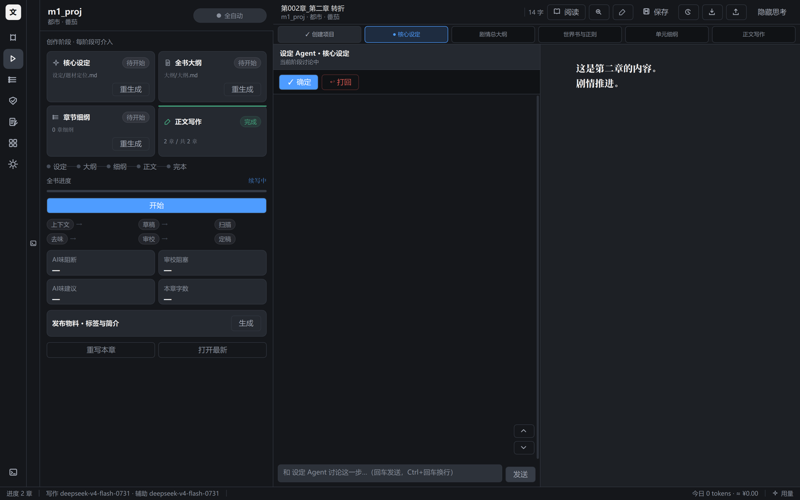
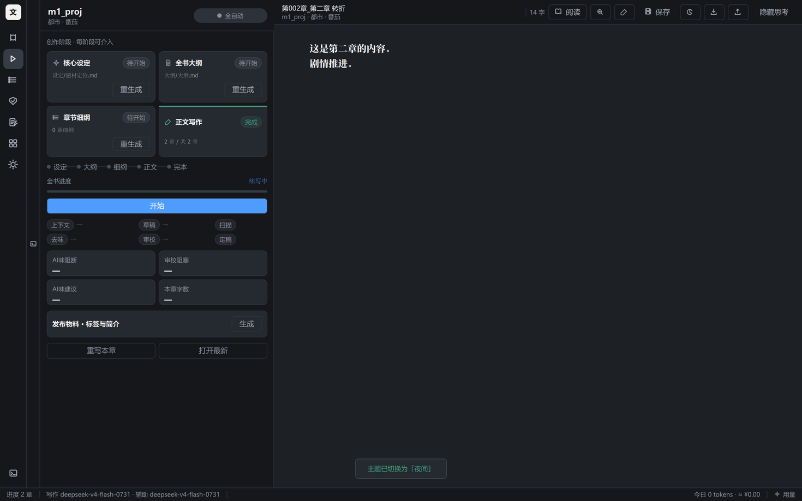
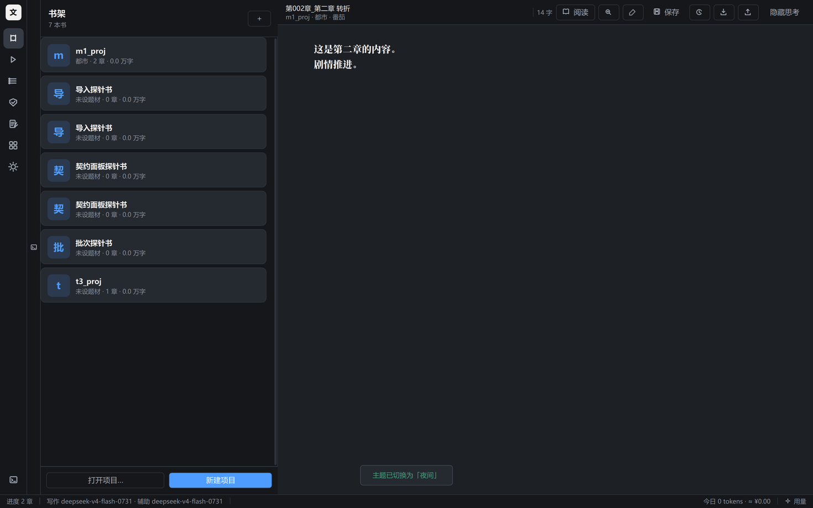
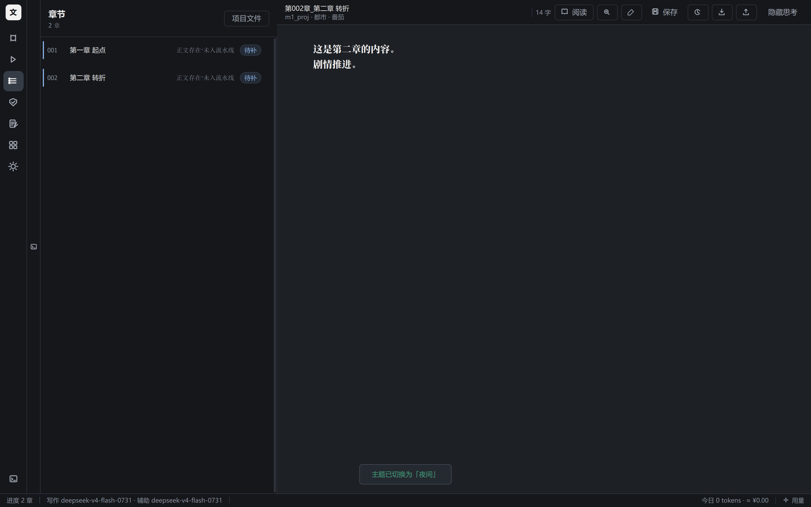
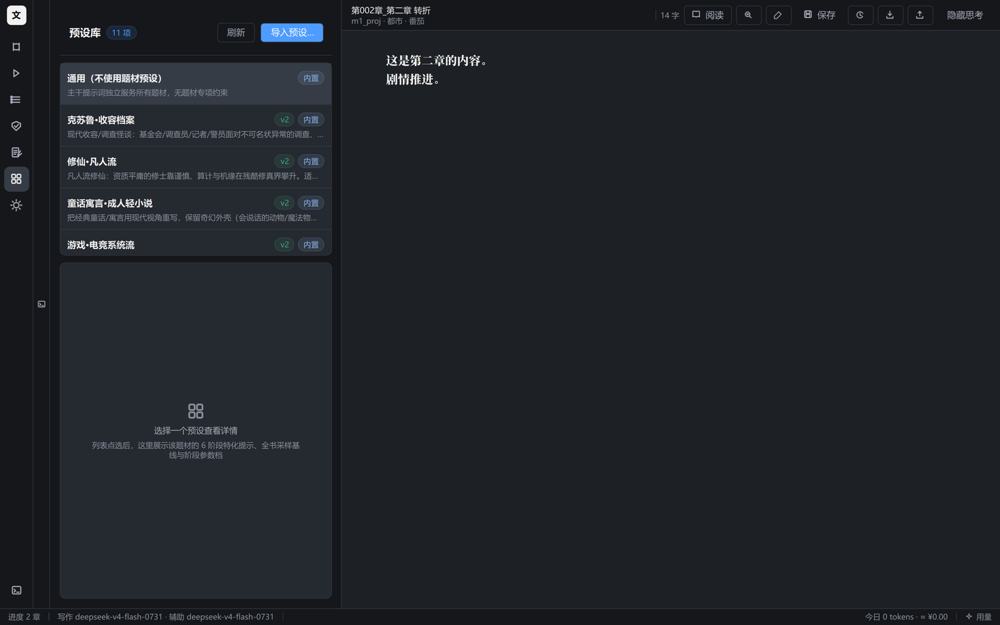
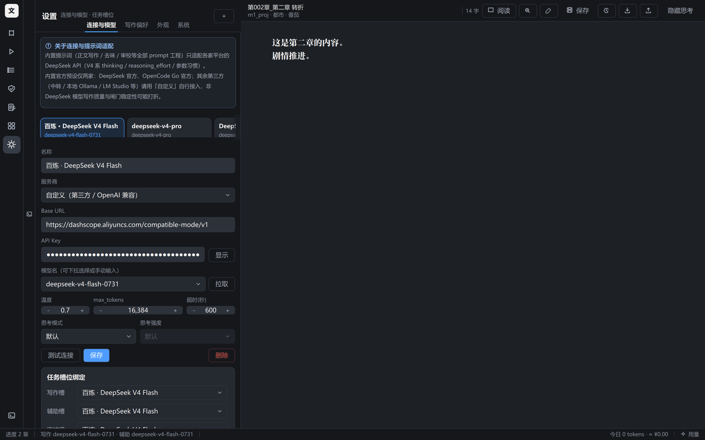

# QianBi Novel (千笔一文)

[中文](README.md) · **English**

**A long-form fiction workbench where a human and an AI co-write** — the AI writes in full
view, and the human stays the author.

The hard part of writing a novel with AI is never "generate one chapter". It's that by
chapter 300 **the setting still holds, the costs still get paid, and the foreshadowing still
gets resolved**. QianBi Novel turns that into a gated pipeline — plus a co-writing interface
where you can intervene at every step.

> **From the author**: I believe the endgame for a writing agent is not "a model that writes
> better" but **a pipeline that knows how to say no** — which is why this may well be the most
> useful writing agent of the years ahead. That is not a benchmark result, it's an engineering
> bet: models get replaced every few months, but once a machine can pin down *"which setting
> was dropped, in which chapter"*, *"this quote does not exist in the text"*, *"this lock
> bypassed this must-rule"* — that evidence compounds. The heaviest parts of this repo are
> exactly that substrate: the prompt-assembly baseline, quote verification, deterministic
> re-checks, and the dual-codebase parity gate. None of it is glamorous. All of it compounds.

- 🗂️ **Entry-based worldbook** — every setting is a registered entry, activated by anchor,
  injected within budget. A long setting doesn't get truncated into mush 500 chapters in.
- ⛓️ **Costs must be paid** — regex contracts at `must` level + causality audit. Cheat-code
  overreach is blocked outright.
- 🤝 **Six-stage co-writing mode** — pitch → core setting → story outline → worldbook &
  rules → chapter outlines → prose. Each stage ends with an explicit "confirm" after you
  argue it out with that stage's agent.
- 🔍 **Three-layer review** — local deterministic L0 pre-check (free) → 6-dimension LLM
  final review (quote-verified, 3-vote denoising) → targeted repair loop.
- 🔄 **Plot backflow** — new settings that emerge in the prose are written back into the
  worldbook and foreshadowing ledger, and constrain everything after. No parallel universes.
- 📥 **Import external documents (built for fan fiction)** — drop in a setting bible: the
  agent decomposes **only what the document actually contains**, every item is verified, and
  a mapping preview must be confirmed before anything is written. Borrowed canon is pinned
  `[常驻]` so budget trimming can't eat it, divergence points become `must` contracts that
  block OOC at lock time, and the whole batch is reversible.
- 📜 **Contract panel** — every rule of this book is visible, editable, deletable; import
  batches are reverted from the same page. A contract should not be a black box.
- 🎨 **10 genre presets** — xianxia underdog / urban second chance / Cthulhu / rule-based
  horror / infinite flow / post-apocalypse / historical intrigue …, each with 6 stage-specific
  prompt sets.
- 🔑 **BYOK, fully local** — bring your own model key. Manuscripts, config and version history
  live on your machine (MIT, no cloud).
- 🖥️ **Windows desktop app** — PySide6 + QML, one installer, no Python required.



---

## Download

| Channel | File | Notes |
|---|---|---|
| **Installer (recommended)** | `QianBi-Novel-v<version>-setup.exe` | Inno Setup, per-user (no admin rights); **creates a desktop shortcut**, uninstallable from *Settings → Apps*, and **uninstalling keeps your manuscripts** |
| **Portable** | `QianBi-Novel-v<version>-portable.zip` | Unzip and double-click. Deliberately installs nothing: no shortcut, no registry, no uninstall entry — delete the folder to remove it. Includes a README inside. |

Program and data are separate: config / presets / logs live in `%USERPROFILE%\.qianbi_novel\`,
while manuscripts default to `%USERPROFILE%\Documents\千笔一文\` (the save location is editable
per book). Both channels share these two places, so switching between them is free.

→ **[Releases](https://github.com/GLFzr/QianBi-Novel/releases/latest)** ·
every release ships a `SHA256SUMS.txt`. Verify before running.

Requirements: Windows 10/11 x64. No Python needed.

---

## Updating

An upgrade never touches your manuscripts. Pick whichever matches what you installed:

| You are using | How to upgrade |
|---|---|
| **Installer** | Download the new `...-setup.exe` and run it into the same location (in-place upgrade). A running instance will be detected and asked to close. |
| **Portable** | Unzip the new folder over the old one — or keep both and launch whichever you like. |
| **In-app** | **About → Check for updates**: shows the release notes and the installer's SHA-256; "Download" opens that release page directly. |

"Not eating your data" is machine-enforced here, not a polite reminder:

- The installer **writes only into the program directory**
  (`%LocalAppData%\Programs\QianBi-Novel`). Manuscripts and config live outside it.
- An in-place upgrade clears the previous program tree first, so no half-old/half-new modules.
- If you point the install location at a folder containing a book or a `config.json`,
  the directory page **blocks you on the spot**.
- Uninstalling removes program files only; config and manuscripts stay untouched.
- A newer build merges an older `config.json` key by key — unknown keys and your own connection
  profiles survive. If the file is unreadable, it is first preserved as
  `config.json.broken-<timestamp>` instead of being silently discarded.

Two defaults worth knowing: **checking for updates at startup is off by default** (turn it on
explicitly in About; only then does each launch fetch one public version manifest from GitHub).
Outside of actions you take in the app, no background task ever rewrites your manuscript.
Backups are those two directories — copying only `.qianbi_novel` loses every book.

---

## Two modes, one kernel

### Automatic — you set the direction, the AI runs the pipeline

```
pitch → core setting → outline → chapter outlines → [per-chapter micro-loop × N] → done
```

The per-chapter micro-loop:

```
① Context assembly  core setting + genre preset + entry worldbook + regex contracts +
                    chapter outline + scene cards + last 3 chapter summaries + character
                    state + unresolved foreshadowing + previous ending
② Draft generation  writing slot, streamed (thinking → generation → done; pausable to read)
③ Word-count gate   local check; expand if short, compress if long, with anti-padding rules
④ AI-taste scan     local regex, free
⑤ De-taste rewrite  up to 2 rounds
⑥ 6-dimension audit review slot, L0 pre-check first
                    ├─ PASS / PASS-WITH-NOTES → eligible for lock
                    └─ REJECT → repair loop (root cause → targeted edit → re-review, 3 rounds)
⑦ Finalize          prose + 4 tracking files + summary chain + per-chapter config snapshot
```

### Co-writing — you can intervene at every stage

Each of the six stages is a multi-turn discussion with its own agent. When you're satisfied,
"confirm" summarizes it and hands off to the next stage:

| Stage | You talk to | What "confirm" does |
|---|---|---|
| Create project | — | Writes the pitch to disk |
| Core setting | Setting agent | Summarizes → handoff block to the next stage |
| Story outline | Outline agent | Same |
| Worldbook & rules | Worldbook agent | Line-by-line contract reconciliation |
| Chapter outlines | Outline agent | Continuity check → rolls the next batch of 5 chapters |
| Prose | Writing agent | Supervisor continuity check → final lock |

Plus two supporting roles: the **Supervisor** handles cross-chapter continuity and scope
control; the **Readback** agent infers what you meant when you hand-edit prose and points
upstream at what should have changed.



---

## Things worth calling out

### The entry-based worldbook engine — `app/wb.py`

Cramming the entire setting into the prompt as one string is the number-one reason long
serials fall apart mid-run: if the budget runs out, the string gets cut, and the cut is a rule.
So settings became entries:

- `parse(doc)` accepts four existing writing styles (bold backflow lines / `### Name` +
  attribute lines / `- Name: description` / table rows); same-name entries merge by
  "normalized name # section"
- every entry has a stable `id` and `content_hash` — "still there but changed" is detectable
- `assemble(proj, num, budget, preset=…, phase=…, anchors=…)` fills the budget by priority:
  **pinned > hits this chapter > recently registered > section weight**, returning
  `activated` / `dropped` as evidence
- Selection order ≠ render order: entries are chosen by priority but always emitted in
  original file order, so the same chapter never sees settings in a different order twice
- the fast path keeps its invariant: if the whole book fits the budget, the file is returned verbatim

### Contracts and cost: regex `must` level

Hard rules from your setting are written as
`rule text｜level：must｜scope：whole book`. `must` rules:

- are injected into **every prompt that can write prose** — generation, expansion,
  compression, de-taste rewrite, local rewrite. All five rewrite whole chapters or whole
  passages, so injecting contracts into the first draft only would leave the middle steps naked
- require the agent to **state where each rule lands in this chapter**; if it can't, and the
  rule conflicts with chapter events, it must ask you instead of quietly routing around it
- enter review dimension D (causality audit); a violation fails
- are **re-checked deterministically**: rules carrying a backticked pattern
  (`` No triple exclamation marks: `!{3,}` ``) are judged locally by `app/mustscan.py` at zero
  cost, with no reliance on model discipline; matched fragments become quotable, verifiable evidence

Precedence is fixed: **explicit author instruction > this book's must rules > this book's
worldbook > chapter outline > genre preset template**.

There is an escape hatch, but it never happens quietly: a deterministic violation blocks final
lock. You can still force-lock, and the violation plus its reason is written into that
chapter's force-lock record.

To be precise about the limit: **injection is not execution**. Natural-language musts
("every fate rewrite must exact a price") are not machine-decidable, so they still rely on
prompt constraints plus the reviewer's judgement — probabilistic. Hard gates only cover the
part that *is* decidable; raising a red flag on something undecidable just manufactures false
blocks, and trains people to force-lock without reading.

"Every fate rewrite must exact a price" should not depend on the model's mood.

### Three-layer review

| Layer | Cost | Does |
|---|---|---|
| **L0 deterministic pre-check** `app/core/scan.py` | free | Mangled proper nouns, ≥15-char repeats, numeric contradictions, missing hook, term drift — hard defects first |
| **6-dimension LLM audit** | review slot | Golden opening / payoff closure / cheat-power consistency / causality / character arc / hook |
| **Quote verification + voting** | same | Every finding must carry a source quote, matched by normalized substring + seed-anchored fuzzy matching; **quotes that fail verification are demoted to marginal and excluded from the repair loop**. k=3 votes per dimension, ties resolved strictly |

The third layer exists because of a very annoying real problem: review models **invent quotes**.
A fabricated "original text" isn't in the chapter at all, and a repair loop acting on it never converges.

### Plot backflow

During prose, models routinely invent settings that were never in the outline. The backflow
chain catches them instead of letting them evaporate:

```
lock chapter → MemoryBackflowWorker extracts
   ├─ new entity / new rule → idempotent write into the worldbook "## 追加登记" section
   │                          (merged in place, first-seen chapter preserved)
   ├─ foreshadowing change  → tracking table updated (dedup on add, hits only unresolved rows)
   ├─ divergence point      → registered as marginal findings
   └─ one-line summary      → appended to the summary chain
```

If the worldbook is edited by hand afterwards, locked chapters get an impact notice (with a
suggestion to explicitly unlock and re-check), and unlocked chapters continue under the new contract.

### Per-chapter config snapshots and "solidify as template"

Each generated chapter writes `正文/.annotations/第N.json`: preset, sampling, per-phase
parameters, which worldbook entries were actually activated or dropped for that chapter, and
the slot/model/prompt_hash of every LLM call. It deliberately does **not** go into
`state.json`, so the state file never balloons.

Right-click in the queue → "View generation config…" shows how a chapter actually grew.
Like it? "Solidify as template" stores those two layers of parameters as a user preset you can
reuse in your next book.

### The prompt-assembly baseline (against silently dropped fields)

`tests/probe_prompt_baseline.py` records the sha256 of 45 assembly-point prompts against a
fixed fixture book. Any change to assembly requires an explicit `--update-baseline`, otherwise red.

`wiring_check()` complements it with **positive assertions**: a preset field that has a value
must appear in the prompt that is supposed to carry it — a missing slot is a `WIRING FAIL`.
The motivation is concrete: a `deslop_extra` field once had zero call sites, so an 84–238
character genre-voice budget vanished silently from every prose prompt — and a byte baseline
can never detect that.

---

## Interface

| | |
|---|---|
| **Bookshelf** — multi-book management, pick a genre preset when creating |  |
| **Chapter queue** — status badges, stale-conclusion hints, pending-fix summary and one-click repair |  |
| **Preset library** — 10 built-ins, import/export your own, preview all 6 stage prompts |  |
| **Settings** — multiple connection profiles, routing across writing/helper/review slots, sampling parameters |  |

Reader: fullscreen immersion (F5), 3 themes (night / parchment / plain white, Ctrl+T to cycle),
3-colour annotation highlights + notes + ideas straight into the writing notebook, per-chapter
position memory, multiple bookmarks.

Versioning: save-driven — a version exists only when you press Save (30 per chapter, with diff
and rollback), 5s debounced drafts plus crash recovery. Export to txt / epub; one-click project
zip backup and automatic daily backups.

---

## Running from source

```bash
git clone https://github.com/GLFzr/QianBi-Novel.git
cd QianBi-Novel
python -m venv .venv
.venv/Scripts/pip install -r requirements.txt
.venv/Scripts/python run.py
```

On first launch, add your API key under *Settings → Connections & models*.
**Keys go into the Windows Credential Manager** (`app/secrets.py`); `config.json` keeps only a
fingerprint, never plaintext. Crash dumps, logs and the telemetry sink are all redacted.

> **Prompt tuning scope**: the built-in prompt engineering (prose / de-taste / review) is tuned
> for the **DeepSeek API** — its thinking, reasoning_effort and parameter habits. The built-in
> official presets cover DeepSeek official and OpenCode Go official only. Anything else
> (relays, local Ollama / LM Studio) can be connected as "Custom (OpenAI-compatible)", but
> prose quality and gate stability may suffer.

---

## Tests

```bash
# Offline unit tests (no API key, ~3 seconds)
.venv/Scripts/python -m pytest tests/unit -q        # 421 tests

# Offline probes: real Bridge + headless QML, covering gates/locks/backflow/relay/import/export
.venv/Scripts/python tests/probe_agent_relay.py
.venv/Scripts/python tests/probe_word_block.py
.venv/Scripts/python tests/probe_backflow_chain.py
# …… 42 probe_*.py in total: 30 run offline, 5 need a real key, probe_packaged is invoked
#     by the release pipeline with --exe
```

| Probe | Covers |
|---|---|
| `probe_prompt_baseline.py` | 45 assembly-point prompt digests + positive wiring assertions for preset fields |
| `probe_qml_compile.py` | Compiles all 40 QML components (a wrong property silently prevents the whole tree from loading) |
| `probe_agent_relay.py` | Co-writing relay orchestration: each agent sees only the previous stage's output, Supervisor context cap, lock trigger point |
| `probe_word_block.py` | Word-count gate, lock interception, force-lock trail, stale queue |
| `probe_backflow_chain.py` | Full backflow chain: idempotency, external edits, missing outline, interruption, re-queue |
| `probe_import_ui.py` | External import: decompose only what exists → preview mapping → write only what's checked → revert by batch |
| `probe_about_ui.py` | Update channel: startup check off by default, failures never reported as "up to date", SHA-256 shown |
| `probe_packaged.py` | Packaged resource manifest audit + dev-vs-packaged assembly digest diff |
| `probe_panel_fit.py` | Six panels: horizontal/vertical overflow, squeezing, out-of-bounds |

**Real LLM end-to-end** (needs a key, ~20 minutes / on the order of ¥0.07):

```bash
.venv/Scripts/python tests/test_5ch_e2e.py
```

---

## Project layout

```
app/
  wb.py                 ★ entry-based worldbook engine (parse / assemble)
  importdoc.py          ★ external document import (chunked decomposition / verification /
                          slot mapping / batch revert)
  mustscan.py           ★ deterministic re-check of must contracts (free)
  secrets.py            ★ API key into Credential Manager + unified redaction
  selftest.py           ★ packaged-mode self check (imports/resources/assembly/QML load)
  usage.py              token and cost accounting
  update_check.py       update check against GitHub Releases
  singleinstance.py     single-instance lock (second launch raises the existing window)
  crash.py / logger.py / diagnostics.py / telemetry.py
  config.py             connection profiles / slot routing / gate policy
  project.py            project read-write (setting/outline/prose/tracking)
  deslop.py             local AI-taste scan (free)
  export.py             txt / epub export
  llm/                  OpenAI-compatible client (streaming/retry/fallback) + provider presets
  prompts/              planning / writing / review / memory / co_writing / scene_cards
  core/
    orchestrator.py     scheduling (QThread / resume / pause & stop)
    stages.py           stage implementations + 6-dimension review + repair loop + record chain
    scan.py             ★ L0 deterministic pre-check (mirrored on both ends)
    state.py            resume state / staleness / needs-human flag
    gates.py            word-count / AI-taste / review gates + count pre-check
    memory.py           summary chain, tracking, backflow writes, worldbook correction proposals
    versions.py         save-driven versions (30 rolling + diff)
    co_writing.py       co-writing state machine
    co_dialogue.py      co-writing workers (Dialogue/Summarize/Readback/Supervisor/Backflow)
  presets/              10 v2 genre presets
  ui/
    bridge.py           Python↔QML bridge
    qml/                Main + 6 panels + Theme (3 themes)
      components/       25 components (ReaderView / CwDialogueDock / ImportDialog / ReviewIssueDialog / …)
scripts/
  build_release.py      one-shot release pipeline (quality gates → version info → packaging →
                          smoke test → digest diff)
  dual_sync_check.py    shared-layer drift check (file level + symbol level AST digests)
tests/
  unit/                 34 files / 421 offline tests
  probe_*.py            42 headless chain probes
  evals/                prompt assembly baseline + review gold set
docs/                   design & planning docs, privacy notice
```

**What one book looks like on disk** (user directory, entirely local):

```
<BookName>/
  设定/    genre & pitch · worldbook · regex rules · blurb & tags · worldview/characters/factions/
  大纲/    outline.md · arc outline · outline_chNNN.md
  正文/    chNNN_title.md
    .versions/     save-driven versions
    .annotations/  per-chapter config snapshots + notes
    .drafts/       debounced drafts
  追踪/    character state · foreshadowing · timeline · context · chapter summaries · global summary
  pipeline_state.json
```

---

## Development

```bash
.venv/Scripts/python scripts/build_release.py     # full release pipeline
.venv/Scripts/python scripts/dual_sync_check.py   # shared-layer drift check
```

This project shares its business core with its sibling `qianbi-Novel-TUI` (a Textual terminal
version): `app/core`, `app/llm`, `app/prompts`, `app/presets` and `app/wb.py`.

Changes to the shared layer must be mirrored on both ends. Beyond file-level comparison there is
a **symbol-level gate**: key symbols are hashed by AST structure (comments, blank lines and line
endings don't count), which bypasses file-level exemptions. Symbols where the GUI intentionally
runs ahead must be registered in `DEFERRED_SYMBOLS` with "reason + the TUI's watermark at the
time" — if the watermark changed, the TUI was edited too, and it fails loudly.

---

## Privacy and security

- **Your data never leaves the machine.** Manuscripts default to `~/Documents/千笔一文/`;
  config, presets, logs and version history live in `~/.qianbi_novel/`. Apart from your model
  API calls there is no cloud. The one exception is the update check: pressing "Check for
  updates" (or explicitly enabling the startup check) fetches one public version manifest from
  GitHub. Nothing is uploaded, and it is off by default.
- **API keys live in the Windows Credential Manager**; no plaintext in the config file. Logs and
  crash dumps are redacted uniformly.
- **Telemetry is off by default**, writes only to local files, and uploads nothing.
  See [docs/PRIVACY.md](docs/PRIVACY.md).
- Third-party dependency and font notices: [THIRD-PARTY-LICENSES.md](THIRD-PARTY-LICENSES.md).

---

## Known limitations

Listed honestly so you don't trip over them:

- **Windows-only packaging.** Linux/macOS require running from source; no distribution testing done.
- **Prompts tuned for DeepSeek.** Other providers produce shakier gate verdicts (the review
  phase now runs at uniformly low temperature to reduce that).
- **Long requests depend on endpoint stability.** Some compatible gateways drop connections on
  long single outputs; the client retries and degrades, but switching models or gateways can
  still surface this.
- **No upstream rework loop in the pipeline.** Changing a setting means manually unlocking the
  affected chapters and re-running (co-writing mode has an entry point for this).
- **`is_chapter_need_human`** is written by the repair loop but not consumed by automatic mode
  yet — it is only a queue marker.
- Chapters that don't converge after 3 repair rounds are marked for human review, not retried forever.
- **External import is "excerpt + mapping", not "read the whole book".** Long documents are
  chunked at 30k characters, capped at 8 chunks; only content genuinely present is processed
  (missing targets are reported explicitly), and anything the model embellishes fails verification.
- **Update checking stops at "notice + direct download".** There is no silent self-install:
  upgrading always means you running the installer, and the startup check is off by default.

---

## Versions

The single source of truth for the version number is `__version__` in `app/__init__.py`.
Full history in [CHANGELOG.md](CHANGELOG.md).

| Version | Theme |
|---|---|
| **v0.17.0** | UI maturation: design system 2.0 (luminance steps/self-drawn controls/desaturated semantics) + modal overlays & five text-overlap fixes + reader heading hierarchy & CJK quotes + root-cause fix for zero panel padding (ScrollView ignores Layout.margins) |
| v0.15.0 | Entry-based worldbook activation + preset assembly layer (scene cards / per-phase sampling / per-chapter snapshots / solidify as template) + three-layer review + plot backflow + word-count gate + packaging parity gate |
| v0.14.0 | Commercial packaging: installer & portable zip, single-instance lock, crash handling, keys into Credential Manager, update check, first-run wizard |
| v0.13.0 | Full port of the TUI's strengths: 10 v2 presets, 6-dimension review + repair loop, 6 scene-card types, 3 themes |

---

## License

[MIT](LICENSE) © 2026 QianBi Novel contributors.

Built with [PySide6](https://www.qt.io/) (Qt for Python), [httpx](https://www.python-httpx.org/),
[Keyring](https://pypi.org/project/keyring/) and others — see
[THIRD-PARTY-LICENSES.md](THIRD-PARTY-LICENSES.md).
