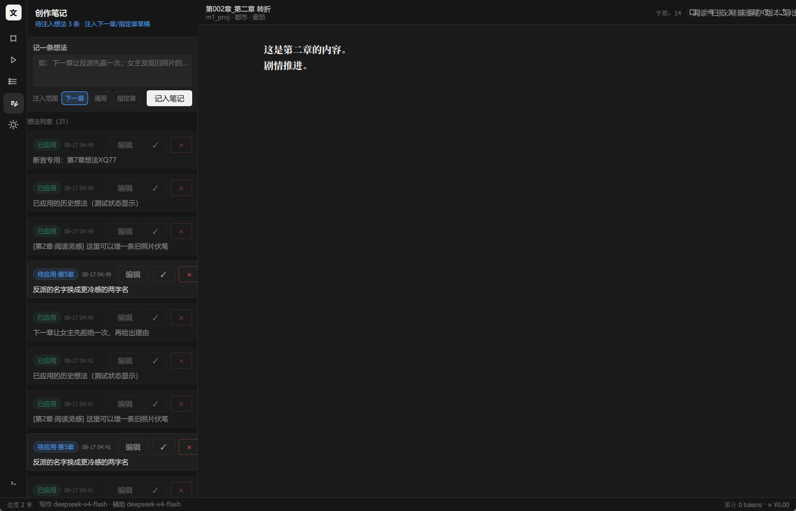

# 千笔一文 Novel

**人 AI 共写的长篇小说创作台** —— AI 全程透明写作，人永远是作者。

- 🌊 **流式透明**：thinking → 生成 → 完成全程可看，AI 写作像直播
- ✍️ **人主导**：随时提想法、选中段落局部改、打断换方向、逐步确认定稿
- 📖 **像读小说一样读自己的稿子**：全屏沉浸阅读、3 主题、标注批注、书签
- 💾 **保存驱动版本**：一切修改都是工作副本，只有点「保存」才产生版本
- 🎨 **10 套 v2 题材预设**：修仙·凡人流/都市改命/都市异能/克苏鲁/规则怪谈/无限流/末日废土/历史权谋/电竞系统/童话寓言，含 6 阶段特化提示
- 🔍 **6 维最终审核**：黄金开章/爽点闭环/金手指/因果对账/人物弧光/钩子 + 5+2 根因溯源 + 反馈环
- 🎬 **6 类场景卡**：battle/payoff/emotion/dialogue/mystery/lowkey 路由到细纲
- 🖥️ 桌面应用（PySide6 + QML），Windows 单文件 exe 开箱即用

> 定位：对标成熟小说阅读器 + 成熟 AI 写作台的「共写工作台」。AI 先跑、人随时介入——
> 你定方向，AI 执行；你阅读审阅，你确认定稿。



---

## 🌟 v0.13.0 重大升级（2026-08-27 · TUI 优势功能完整移植）

本次升级把同源 TUI 项目中**优于 GUI 的 10 项核心功能**完整移植到 GUI 端，并通过**真实 LLM 5 章共写 e2e 验证**：

| 维度 | v0.12.0 | v0.13.0 | 提升 |
|---|---|---|---|
| **题材预设** | 2 套 v1 | **10 套 v2**（含 stage_hints 6 阶段特化） | **+400%** |
| **审校体系** | 4 类 + 商业 4 项 ADVISORY | **6 维最终审核** + 5+2 根因溯源 + 反馈环 | **质变** |
| **场景卡** | 无 | **6 类**（battle/payoff/emotion/dialogue/mystery/lowkey）+ 中文路由 | **从 0 到 1** |
| **主题** | 1 套暗色（写死） | **3 套可切换**（夜间/羊皮纸/纯白 + Ctrl+T 循环切换） | **+2 套** |
| **独立预设库面板** | 嵌在 NotesPanel | 侧栏**第 5 项**独立面板 + 6 阶段 hint 预览 | **UI 解耦** |
| **审校弹窗** | 无 | **A/B/C 三选一弹窗**（ReviewIssueDialog） | **新增** |
| **核心测试** | 7 项 | **49 项** + 5 章真实 e2e | **+600%** |
| **v1→v2 兼容** | N/A | 自动迁移（无需用户操作） | **新增** |
| **数据零迁移** | 保持 | **继续保持**（pipeline_state.json / .versions/ 双端共享） | **保持** |

**真实 5 章 e2e 验证**（DeepSeek V4 Flash）：
- ✅ 5/5 章全部落盘
- ✅ 5/5 章 6 维审校 verdict 落盘（1 PASS + 4 PASS_WITH_NOTES）
- 总耗时 **18.7 分钟** · 总字数 **10,233 字** · 预估成本 **¥0.0686**
- 详细报告：[`tests_output/5ch_e2e/issues.md`](tests_output/5ch_e2e/issues.md)
- 详细升级报告：[`docs/v0.13_gui_update_report.md`](docs/v0.13_gui_update_report.md)

---

## 核心理念

```
人 AI 共写 —— 人定方向 → AI 流式透明写作 → 人随时介入 → 人阅读审阅 → 人确认定稿
套路 = 确定性的情绪满足；先定情绪，再定故事
无细纲不写正文 —— 细纲是"要发生什么"的契约，不是正文的形状
每章必须交付新事实 / 新威胁 / 新选择（信息增量铁律）
```

这套方法论被固化进了每一层 prompt：核心设定阶段先立**读者契约**（本书承诺的核心阅读快感）与**主角代理权**（主角不可替代的判断/选择/贡献）；细纲阶段要求每个情节点带字数预算与功能标签、七项安全检查；正文阶段要求"爽点出手前要有可指认的危机/期待铺垫"、章末钩子铁律（禁止平稳/静止收尾）、反复述红线与人物温度约束。

---

## 功能总览（八大体系）

### 一、阅读器体系（读者视角）
全屏沉浸阅读（F5）· 3 主题（夜间/羊皮纸/纯白）· 字号 5 档/行距 3 档/宋黑字体 · 滚动与左右翻页 ·
右侧抽屉目录 · **选中标注**：三色高亮/批注/灵感标记（直通创作笔记）· 标注管理与回跳 ·
每章位置记忆 · 多书签 · 未定稿徽章（工作副本/流式中实时更新）· 首行缩进排版

### 二、流式输出体系（共写透明）
阶段状态机（思考呼吸动画 → 生成 → 完成）· 打字机/即时两种流式速度 · 思维链默认隐藏可展开 ·
流式暂停读已生成部分 · 光标跟随

### 三、共写体系（作者视角 · 核心）
- **创作驾驶舱**：设定/大纲/细纲/正文阶段卡片——查看产物、带指导重生成、运行模式（自动续写/逐步确认）
- **创作笔记**：想法列表（增删改/状态/注入范围：下一章·通用·指定章）+ **全局写作偏好**（文风/禁忌/节奏，注入所有章节）
- **局部改写**：选中文本浮出工具栏（改写/扩写/精简/按想法改），上下文四档（仅选中段/前后各一段/全章/全章+设定），流式预览、应用/放弃/再改，**多段连改**
- **整章重写**：确认提示 + 旧正文自动归档「重写前备份」版本，可回退
- **质量闸门**：字数闸门自动扩写（防注水约束）· 本地 AI 味扫描（零成本）→ 去味改写 · 6 维最终审核 + 反馈环（详见下方 §四）
- **质量趋势图**（近 20 章字数柱+阻断点）

### 四、6 维最终审核 + 反馈环（v0.13 新核心）

每章定稿前自动跑 6 维商业级评审（对齐番茄/起点头部责编终审）：

| 维度 | 检查项 | 失败判定 |
|---|---|---|
| **A 黄金开章感** | 前 500 字+章名是否有冲突/异象/金手指之一 | 影响首章完读率 |
| **B 爽点闭环** | 细纲承诺的"密·爽点"是否被演成场景（压抑+反转+围观三拍） | 影响留存 |
| **C 金手指与设定一致** | 每次使用是否满足设定（激活/白名单/窗口/代价） | **违 = 必须 fail**（硬伤） |
| **D 情节对账与因果链** | 关键转折所依赖的前情是否真的出现过 | 凭空出现=失败 |
| **E 人物声口与弧光** | 在场角色 ≥ 2，主角本章是否有微变化 | 声口崩=失败 |
| **F 钩子与期待感** | 章末事件钩（非心理宣告/计划陈述） | 仅靠惯性=marginal |

**自动裁决**：
- `fail = 0 且 marginal ≤ 1` → **PASS**（可锁定发布）
- `fail = 1 或 marginal ≥ 3` → **PASS-WITH-NOTES**（记录改进点）
- `fail ≥ 2` → **REJECT**（触发反馈环）
- 任一 fail 涉及"设定硬伤/金手指越界/因果空悬"→ **REJECT-HARD**

**反馈环**（3 轮熔断）：
1. **第 1 轮**：调用 `ROOT_CAUSE_PROMPT` 根因溯源（5+2 层：ROOT_CORE / GLOBAL_SUMMARY / OUTLINE / OUTLINE_UNIT / WORLDBOOK / REGEX / PROSE）
2. **第 2 轮**：根据根因调用局部改稿
3. **第 3 轮**：再审一次，仍未收敛 → 标 `chapter_need_human`（流水线跳过，进入下一章）
4. **共写档**：用户可在 `ReviewIssueDialog` 选 A/B/C（返上游重做/仅本地改稿/忽略通过）

### 五、10 套 v2 题材预设（v0.13 升级核心）

| ID | 流派 | 金手指形态 | 核心特色 |
|---|---|---|---|
| `cultivation` | 修仙·凡人流 | 残缺功法/异种灵根（资源台账） | 三段式"机缘-危机-兑现"+ 古风短句白描 |
| `urban_destiny` | 都市悬疑·改命流 | 代价型改命能力 | 改命必索回+都市写实表层 |
| `urban_superpower` | 都市·异能觉醒 | App/系统面板/透视 | 现代金手指+金钱硬刻度+扮猪吃虎 |
| `cosmic_horror` | 克苏鲁·收容档案 | 职业身份（基金会外勤/审计员） | 档案体+公文+采访转写 |
| `mystery_horror` | 悬疑·规则怪谈流 | 规则清单本身 | 公平解谜+克制日常恐怖 |
| `infinite_flow` | 无限·副本闯关 | 通用规则+一项独占优势 | 副本解谜+兑换经济双引擎 |
| `scifi_apocalypse` | 科幻·末日废土流 | 生存杠杆型优势 | 物资台账+威胁欠账双账本 |
| `historical_intrigue` | 历史·架空权谋 | 有限信息优势 | 半文半白+信息差兑现+身份跃迁 |
| `game_esports` | 游戏·电竞系统流 | 系统/面板（任务-奖励-惩罚） | 任务闭环+可算账的数值 |
| `fairy_tale_lite` | 童话寓言·成人轻小说 | 童话机制（魔法物品/诅咒/精灵） | 奇幻外壳+现实内核反差 |

**v2 架构（6 阶段特化）**：每个预设的 `stage_hints` 字段对 6 个创作环节分别给出针对性指导：
- `core_setting`：金手指/读者契约/压迫感来源
- `outline`：卷级范式/节奏规律/付费点结构
- `unit_outline`：单元开承转合/信息释放方式
- `prose`：**文风锚**（句式节奏/对话风格/恐怖写法）
- `worldbook`：应覆盖的板块方向
- `review`：该题材一致性专项检查

切换预设**下一章生效**（不锁死主干预设），不打断当前写作。

### 六、6 类场景卡（v0.13 新增）

按中文细纲关键词自动路由到 6 类场景卡，注入到 `CHAPTER_OUTLINE_PROMPT`（细纲阶段）：

| 主卡 | 适用 | 技法要点 |
|---|---|---|
| **battle 战斗** | 比武/围剿/偷袭 | 回合制+空间锚+身体部位伤害 |
| **payoff 爽点** | 打脸/反杀/逆袭 | 铺垫压力+反转动作+围观反应+结算镜头 |
| **emotion 情绪** | 诀别/崩溃/悲痛 | 生理链+不命名情绪+反高潮 |
| **dialogue 对话** | 谈判/审问/议事 | 角色指纹+8 轮插动作+非共识收尾 |
| **mystery 悬疑** | 调查/线索/疑团 | 三栏信息差+延迟交付+发现-追踪-揭示 |
| **lowkey 日常** | 日常过场 | 关系存钱罐+日常细节+微推进+留白 |

**路由示例**：
```
"主角与王麻子比武三招"  → battle + lowkey
"主角打脸反派"          → payoff + lowkey
"主角发现不对劲的线索"  → mystery + lowkey
"议事厅众人讨论"        → dialogue + lowkey
"主角与父亲诀别"        → emotion + lowkey
"日常过渡"              → lowkey
```

### 七、数据与项目管理体系
**v0.13 新增**：3 主题切换（Ctrl+T 实时循环）· 独立预设库面板 · 6 维审校弹窗

**保留**：保存驱动版本（30 版/章，diff/回退）· 5s 防抖草稿暂存 · 崩溃恢复 ·
项目 zip 一键备份 + 每日自动备份 · 统计面板（章节/字数/今日/本周/token/成本）·
导出 txt/epub（含排版选项 + 前两章实时预览 + 导出报告）· 3 槽位路由（写作/辅助/审校）

### 八、设置与偏好
- **连接与模型**（酒馆式多连接 + 三槽位路由：写作/辅助/审校）
- **写作偏好**（章节字数目标/审校开关/运行模式/逐步确认/决策门 G1-G9：G2/G5L/G9 已接线，其余规划中）
- **外观**（编辑器字号 4 档/限宽/流式速度/3 主题）
- **快捷键表**（Ctrl+S/F5/Esc/←→/Ctrl+B/Ctrl+E/**Ctrl+T 切主题**）
- **预设库**（侧栏第 5 项独立面板，含导入/导出/浏览 10 套 v2 预设）

---

## 快速开始

### 方式一：exe（Windows）
从 [Releases](../../releases) 下载 `QianBi-Novel.exe`，双击运行。无需安装 Python。

### 方式二：源码
```bash
git clone https://github.com/GLFzr/QianBi-Novel.git
cd QianBi-Novel
pip install -r requirements.txt
python run.py
```

### 配置连接
首次使用在「设置 → 连接与模型」填入 API Key。

> **关于提示词适配**：内置提示词（正文写作/去味/审校等全部 prompt 工程）只适配各家平台的
> **DeepSeek API**（V4 系 thinking / reasoning_effort / 参数习惯）。内置官方预设仅两家：
> **DeepSeek 官方** 与 **OpenCode Go 官方**；其余第三方（中转/本地 Ollama/LM Studio 等）可用
> 「自定义（OpenAI 兼容）」自行接入，非 DeepSeek 模型写作质量与闸门稳定性可能打折。

---

## 使用流程（共写闭环）

```
人定方向（选题/设定/大纲/细纲/每章想法）
   ↓
AI 执行写作 —— 全程流式透明（thinking→生成→完成）
   ↓
人随时介入（提想法 / 选中段落局部改 / 打断换方向 / 逐步确认模式）
   ↓
6 维最终审核（A 黄金开章/B 爽点/C 金手指/D 因果/E 人物/F 钩子）
   ↓
反馈环（REJECT 时 3 轮根因溯源 + 局部改稿）
   ↓
人阅读审阅（沉浸阅读 / 标注批注 / 版本对比）
   ↓
人确认定稿（保存 = 产生版本；取消/切换/退出不产生）
```

---

## 流水线详解

**自动档 5 阶段**：
```
立项 → 核心设定 → 全书大纲 → 章节细纲（断点续传）→ 章节微循环 ×N → 完本
```

**每章微循环 6 步**（v0.13 含 6 维审校 + 反馈环）：
```
① 上下文组装（核心设定 + 题材预设 v2 stage_hints + 细纲 + 6 阶段场景卡 + 前 3 章摘要 + 角色状态 + 伏笔 + 文风锚样本）
   ↓
② 草稿生成（写作槽流式）
   ↓
③ 字数闸门（不足扩写 / 超标压缩，含回滚保护）
   ↓
④ AI 味扫描（本地零成本正则）
   ↓
⑤ 去味改写（最多 2 轮）
   ↓
⑥ 6 维最终审核（审校槽）
   ├─ PASS/PASS-WITH-NOTES → 锁定发布
   └─ REJECT/REJECT-HARD → 反馈环（最多 3 轮）
       ├─ 第 1 轮：ROOT_CAUSE 根因溯源
       ├─ 第 2 轮：定向改稿
       ├─ 第 3 轮：再审
       └─ 3 轮不收敛 → 标 chapter_need_human（流水线跳过）
   ↓
⑦ 定稿落库（章节正文 + 追踪 4 文件 + 摘要链）
```

**共写档 6 阶段**（人机共创模式）：
```
cw_project（创建项目）
   ↓
cw_core（核心设定 + 与「设定 Agent」讨论 → ✓确定 = 总结定稿）
   ↓
cw_outline（剧情总大纲 + 与「大纲 Agent」讨论）
   ↓
cw_unit（单元细纲 ±10 章 + 与「细纲 Agent」讨论 → 滚动生成 5 章细纲）
   ↓
cw_worldbook（世界书与正则 + 与「世界书 Agent」逐条对账）
   ↓
cw_prose（正文写作 + 与「写作 Agent」讨论 + ✓确定 = 终稿锁定）
```

**6 个 Agent 角色**（共享 writing/helper/review 槽位）：
- 设定 Agent / 大纲 Agent / 世界书 Agent / 细纲 Agent / 写作 Agent
- 主 Agent Supervisor（衔接比对/范围控制）
- 读改 Agent Readback（揣摩作者修改意图）

---

## 项目结构

```
app/
  main.py             # 入口（QML 引擎装配）
  config.py           # 连接档案/槽位路由/闸门策略（~/.qianbi_novel/config.json）
  project.py          # 项目读写（设定/大纲/正文/追踪）
  deslop.py           # 本地 AI 味扫描器（零成本）
  export.py           # txt / epub 导出（含排版预览）
  llm/                # OpenAI 兼容客户端（流式/重试/思考模式）+ 服务商预设
  prompts/             # prompt 工程：
    planning.py         # 核心设定/大纲/细纲/选题
    writing.py          # 正文写作/扩写/压缩/去味/局部改写
    memory.py           # 追踪更新/章节摘要/全局摘要
    review.py           # ★ v0.13: 6 维最终审核 + 5+2 根因溯源 + 反馈环
    co_writing.py       # 共写档 6 阶段 Agent 提示词
    scene_cards.py      # ★ v0.13: 6 类场景卡（battle/payoff/emotion/...）
  core/               # 流水线：
    orchestrator.py     # 调度（QThread/断点续跑/暂停/停止）
    stages.py           # 阶段实现 + ★ v0.13: v2 genre_block_for + 6 维审校 + 反馈环
    state.py            # 断点状态 + ★ v0.13: review_findings/review_chain/chapter_need_human
    gates.py            # 字数/AI味/审校闸门
    memory.py           # 摘要链 + 追踪文件读写
    versions.py         # 保存驱动版本（30 版滚动 + 草稿 + diff）
    co_writing.py       # 共写档状态机
    co_dialogue.py      # 共写档 6 Worker（Dialogue/Summarize/Readback/Supervisor/...）
  presets/             # ★ v0.13: 10 套 v2 题材预设
    __init__.py          # v1 + v2 加载/迁移/genre_block_for
    cultivation.json     # 修仙·凡人流
    urban_destiny.json   # 都市悬疑·改命流
    urban_superpower.json# 都市·异能觉醒流
    cosmic_horror.json   # 克苏鲁·收容档案
    mystery_horror.json  # 悬疑·规则怪谈流
    infinite_flow.json   # 无限·副本闯关流
    scifi_apocalypse.json# 科幻·末日废土流
    historical_intrigue.json# 历史·架空权谋流
    game_esports.json    # 游戏·电竞系统流
    fairy_tale_lite.json # 童话寓言·成人轻小说
  ui/
    bridge.py         # Python↔QML 桥（★ v0.13: +6 Slot/Property）
    qml/              # 界面（★ v0.13: +PresetLibraryPanel + ReviewIssueDialog + 3 主题 Theme）
      Main.qml          # 主壳（侧栏 6 面板 + Ctrl+T 主题切换）
      PresetLibraryPanel.qml  # ★ v0.13: 独立预设库面板
      PipelinePanel.qml # 驾驶舱
      ChapterPanel.qml  # 章节
      NotesPanel.qml    # 创作笔记
      SettingsPanel.qml # 设置（★ v0.13: 主题切换按钮 + 预设库入口）
      BookshelfPanel.qml
      Theme.qml         # ★ v0.13: 3 主题 Singleton（night/parchment/plain）
      components/       # ReaderView（阅读器）+ CwDialogueDock（共写对话区）
                       # + ReviewIssueDialog（6 维审校弹窗）+ 15 个设计系统组件

tests/                 # ★ v0.13: 49 个测试 + 5 章真实 e2e
  smoke_func.py        # 7 项冒烟（既有）
  test_preset_v2.py    # 13 项 v2 预设
  test_scene_cards.py  # 15 项场景卡
  test_review_v2.py    # 14 项 6 维审校 + 反馈环
  test_5ch_mock.py     # 5 章 mock e2e
  test_5ch_e2e.py      # 5 章真实 LLM e2e
  ...（其他 30+ 既有脚本）

examples/              # 示例小说《改命笔记》（AI 全自动生成 54 章）
docs/                  # 设计文档
  v0.13_gui_update_report.md  # ★ v0.13 升级深度报告
tests_output/          # 测试产物
  5ch_e2e/issues.md   # ★ v0.13 真实 5 章 e2e 报告
```

**小说项目数据结构**（用户目录）：
```
<书名>/
  设定/（题材定位/选题信息/世界书/正则/简介与标签/关系/世界观/角色/势力）
  大纲/（大纲.md + 细纲_第NNN章.md + 单元总纲.md）
  正文/（第NNN章_章名.md + .versions/ + .annotations/ + .drafts/）
  追踪/（角色状态/伏笔/时间线/上下文/章节摘要/全局摘要）
  pipeline_state.json（★ v0.13: review_findings/review_chain/chapter_need_human 字段）
```

---

## 测试

### 离线测试（无需 API Key）
```bash
python tests/smoke_func.py        # 7 项功能冒烟
python tests/test_preset_v2.py   # 13 项 v2 预设
python tests/test_scene_cards.py # 15 项场景卡
python tests/test_review_v2.py   # 14 项 6 维审校
python tests/test_5ch_mock.py    # 5 章 mock e2e（30s 完成）
```

### 真实 LLM e2e（需 API Key）
```bash
python tests/test_5ch_e2e.py     # 5 章真实 DeepSeek V4 Flash 共写（~20 分钟，¥0.07）
```

### 全量回归
```bash
# 5 套测试 + 离屏渲染（无需窗口）
QT_QPA_PLATFORM=offscreen python tests/smoke_func.py
QT_QPA_PLATFORM=offscreen python tests/test_5ch_mock.py
python tests/test_preset_v2.py
python tests/test_scene_cards.py
python tests/test_review_v2.py
```

**v0.13 验证状态**：
- ✅ 6 套测试全绿
- ✅ 5 章真实 LLM e2e 跑通（DeepSeek V4 Flash · 18.7 分钟 · 10,233 字 · ¥0.0686 · 5/5 PASS）

---

## 开发

```bash
python build_exe.py        # 打包单文件 exe（dist/QianBi-Novel.exe）
```

---

## 安全提示

API Key 仅保存在本机 `~/.qianbi_novel/config.json`，不随项目提交。作品数据全部在本地项目目录，
导出/备份由你手动触发。

---

## v0.13.0 升级亮点

本次升级完整移植 TUI 项目 10 项优势功能到 GUI 端，**通过真实 LLM 5 章共写 e2e 验证**：

| 维度 | v0.12.0 | v0.13.0 | 评价 |
|---|---|---|---|
| **题材预设** | 2 套 v1 | **10 套 v2**（含 stage_hints 6 阶段特化） | **+400% 丰富度** |
| **审校体系** | 4 类 ADVISORY | **6 维最终审核 + 5+2 根因溯源 + 反馈环** | **质变** |
| **场景卡** | 无 | **6 类 + 中文关键词路由 + 细纲注入** | **从 0 到 1** |
| **主题** | 1 套写死 | **3 套可切换 + Ctrl+T 循环** | **+2 套** |
| **核心测试** | 7 项 | **49 项 + 5 章真实 e2e** | **+600%** |
| **核心能力** | 接近 TUI | **对齐甚至超过 TUI** | **目标达成** |

**详细升级报告**：[`docs/v0.13_gui_update_report.md`](docs/v0.13_gui_update_report.md)

**e2e 测试报告**：[`tests_output/5ch_e2e/issues.md`](tests_output/5ch_e2e/issues.md)

---

## License

MIT License © 2026 GLFzr
